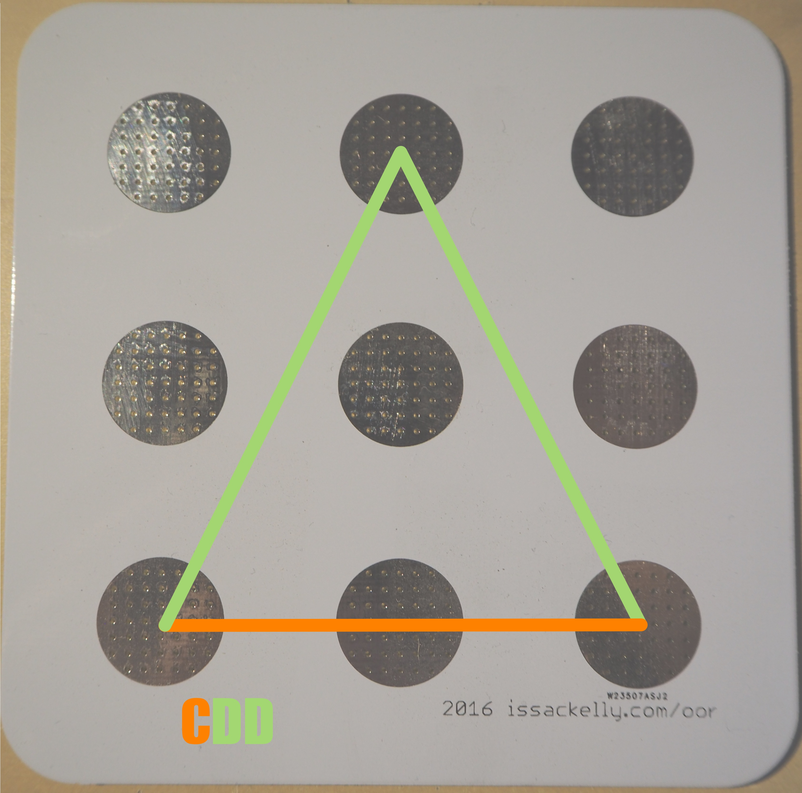

# Open Object Detection

### Alpha Quality

This project is for object detection.

Here's the idea: Place an object on a screen, the computer knows which object you put on the screen. 

This implementation deals with fixed, preconfigured, precalibrated objects on capacitive touch screens.

The object is recognized as a pattern of "touches", as if your fingers were in a certain position while they touch the monitor.

Examples:

* Four fingers in a square with sides 1.5" long, that's object *A*
* Three fingers in a right trangle with sides 0.75" that's object *B*
 
## Hardware Implementation:

The current hardware implementation is a printed circuit board with 9 dots on it. Each dot represents one possible touch point.
Attaching conductive feet to dots creates the pattern of touch points.

Ideal material research for conductive feet is ongoing, but wrapping something soft, with consistent height (felt, rubber)
with something conductive (foil, foil tape) seems to work pretty well.

## Software Implementation:

The software works by classifying the distances between points. Each unique registered shape has a set of unique verticies and distances between verticies.

The nine dot pattern of our prototype has 5 different line segments that can be drawn by connecting any two points.

There are some special properties when the dots are in this pattern. We can extrapolate all of these by applying Pythagorean's theorem.

If you consider A to be of length 1.

    A = 1
    B = √2 (B = √(A² + A²)
    C = 2  (C = 2 * A)
    D = √5 (D = √(A² + C²)
    E = 2√2 (E = 2 * B)

This means that it's possible to implement the whole list of objects just knowing the distance of A. This is not currently implemented in the code.
If you're learning JavaScript or Geometry, or both, reimplementing the `classify_distance` function from one of the config files would be a good idea!

Ask if you'd like help.

--

A pattern with 3 verticies (touches) will have 3 edges. (2 + 1)
A pattern with 4 verticies will have 6 edges. (3 + 2 + 1)
A pattern with 5 verticies will have 10 edges (4 + 3 + 2 + 1)

--

Once you have a list of verticies, we can get the distances between each pair of verticies.
We throw out distances that don't look like they fit into A-E, and if enough are left we try to find an object.

--

Once we've identified the distances between points, we then classify the distances. If they fit in proper bounds, they're given a classification (A-E)
We sort by letter, and look up the classification in the OBJECTS list to see if we are supporting that object, and what its name is.

 
--

## Javascript Implementation

The javascript implementation is meant for a touch enabled browser. You need to include the object list, and the calibration

If we are supporting that object, then the `object_detected` event is fired.

If we don't support that object, then the `no_object_detected` event is fired.

See [./experiments/ipad.html] or [./experiments/planar_windows10.html] for a minimal example.

(This is still mostly a proof of concept. Implementation details like packaging and testing could and should change over time as this library evolves) 

### Implementation notes

You can always use your fingers to test! It's less specific, but you can usually use three to move them in the right position. Play around.

The non-iPad monitors I've tested have been less responsive than the iPad I have. We're still working on that.

#### Windows 10

You need to turn on touch support in the Edge browser. open "about:flags" in the browser and turn on touch events.

https://www.thurrott.com/windows/windows-10/5043/windows-10-tip-make-microsoft-edge-work-the-way-you-want

Chrome might also have touch flags, this hasn't been explored yet.

#### Safari iOS

Don't forget that if you plug your device in, you can use Safari on the desktop to view the browser console!

https://developer.apple.com/safari/tools/

--

